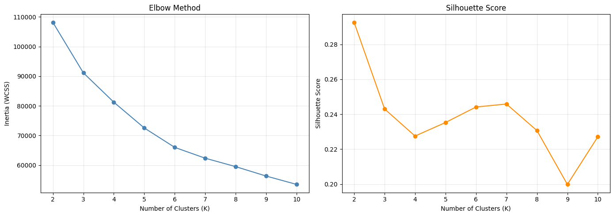
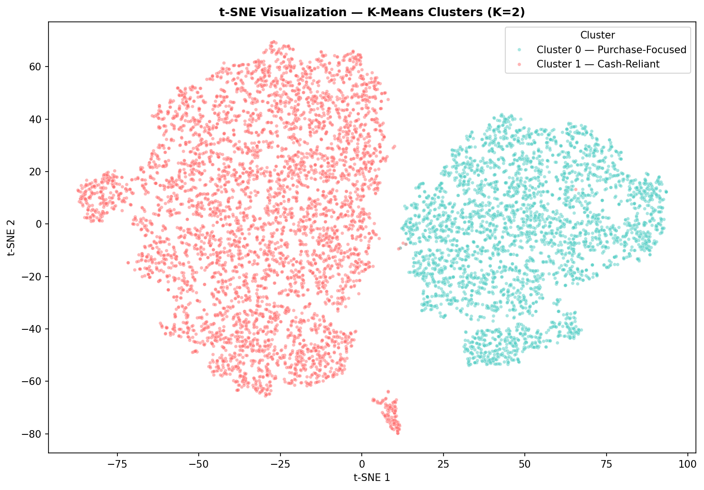
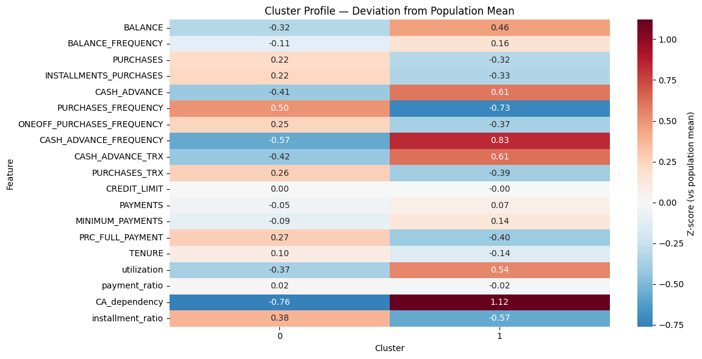

# 🗂️ Credit Card Customer Segmentation

Unsupervised segmentation of 8,950 credit card customers using behavioral data. Three clustering algorithms (K-Means, Hierarchical, DBSCAN) are applied and cross-validated to produce a robust, actionable segmentation framework.

---

## 📌 Problem Statement

Marketing teams need to understand who their customers are before designing targeted strategies. This project identifies distinct behavioral segments from credit card usage data — without any predefined labels — so that campaigns, product offers, and risk strategies can be tailored per group.

---

## 📂 Dataset

**Source:** [Credit Card Dataset for Clustering — Kaggle (arjunbhasin2013)](https://www.kaggle.com/datasets/arjunbhasin2013/ccdata)

| Property | Value |
|---|---|
| Rows | 8,950 customers |
| Features | 18 behavioral features |
| Target | None (unsupervised) |

**Missing values:** `MINIMUM_PAYMENTS` and `CREDIT_LIMIT` filled with median.

---

## 🔧 Feature Engineering

Four derived features were created to capture relative behavior rather than raw amounts:

| Feature | Formula | Business Meaning |
|---|---|---|
| `utilization` | `BALANCE / CREDIT_LIMIT` | How much of the credit limit is actively used |
| `payment_ratio` | `PAYMENTS / MINIMUM_PAYMENTS` | Repayment responsibility (ratio ≈ 1 = paying minimum only) |
| `CA_dependency` | `CASH_ADVANCE / (PURCHASES + CASH_ADVANCE)` | Reliance on cash withdrawals vs normal purchases |
| `installment_ratio` | `INSTALLMENTS_PURCHASES / PURCHASES` | Preference for structured, planned purchases |

> Division-by-zero cases are replaced with `0` (customer made no activity in that category).

---

## ⚙️ Preprocessing Pipeline

```
Raw Data
   ↓ Fill missing values (median)
   ↓ Feature Engineering (4 derived features)
   ↓ Drop high-correlation features (threshold > 0.85)
   ↓ Skewness Reduction
       - Cap extreme outliers at 99th percentile (skew > 10)
       - log1p transform (skew > 1.0)
   ↓ StandardScaler
   ↓ PCA (8 components, ~91% variance retained)
   ↓ Clustering
```

---

## 📐 Dimensionality Reduction

**PCA** reduces 19 features to **8 principal components** (~91% variance retained), addressing the curse of dimensionality before clustering.

**t-SNE** is used separately for 2D visualization only — not as input to clustering.

---

## 🤖 Clustering Algorithms

### K-Means



- Optimal K selected using Elbow Method + Silhouette Score
- **Winner: K=2** (Silhouette ≈ 0.29, largest WCSS drop at K=2→3)

### Hierarchical Clustering
- Ward linkage on PCA-reduced data
- Dendrogram shows largest gap at top split → K=2
- Silhouette score peaks at K=2 (≈ 0.26)

### DBSCAN
- `eps` selected from k-distance plot (k = 2 × n_features = 16)
- Used as **outlier detection**, not primary segmentation

---

## 📊 Key Results

### Primary Segmentation (K-Means K=2)



| Segment | Size | Behavior |
|---|---|---|
| Cluster 0 — Purchase-Focused | 5,330 (60%) | High purchase frequency, low cash advance dependency, pays responsibly |
| Cluster 1 — Cash-Reliant | 3,620 (40%) | High cash advance dependency, low purchase activity, carries balance |

> Both segments share similar credit limits — the split reflects **behavioral patterns**, not income level.

### Cluster Profile



### Cross-Algorithm Validation

K-Means and Hierarchical Clustering agree on **90.7%** of customer assignments at K=2, confirming the binary structure is genuine and not an artifact of any single algorithm.

### Outlier Detection (DBSCAN)

| Group | Size | Notable Pattern |
|---|---|---|
| Noise (-1) | 295 (3.3%) | Newest customers — TENURE -2.16 SD below average |
| Micro cluster (1) | 14 (0.2%) | Hyper-active one-off shoppers with high purchase frequency |

---

## 💡 Key Insight

All Silhouette scores remain below 0.30, which indicates that customer behavior lies on a **continuous spectrum** rather than splitting into sharply distinct groups. K=2 is the strongest natural break, but clusters should be interpreted as behavioral *tendencies*, not rigid categories.

---
## ⚠️ Limitations

- Customer behavior shows weak intrinsic dimensionality (single primary axis), 
  resulting in low absolute Silhouette scores (~0.26–0.29) across all methods
- Domain expertise required to translate behavioral patterns into business strategies
- Static snapshot — does not capture behavioral changes over time
- No CLV or profitability data available — business impact of each segment cannot 
  be quantified without input from the business team

**Suggested Next Steps (Pending Domain Validation)**
1. Validate behavioral hypotheses with banking domain experts
2. Design A/B test for differentiated marketing per segment
3. Investigate the 14-customer micro-cluster as a case study
4. Build onboarding strategy for the 295 newcomer outliers
---

## 🚀 How to Run

1. Download the dataset from Kaggle (`CC GENERAL.csv`)
2. Open the notebook in Kaggle or Jupyter
3. Run all cells in order — preprocessing → PCA → clustering → profiling

```python
# Key dependencies
pip install -r requirements.txt
```

---

## 🔮 Future Improvements

This project achieved its objective — identifying 2 validated behavioral segments with 90.7% cross-algorithm agreement, supplemented by DBSCAN outlier detection. The natural next step is business validation: confirming that the segments are actionable before designing campaigns around them.

If further clustering is needed, the continuous spectrum nature of this data suggests exploring models better suited for soft boundaries.
